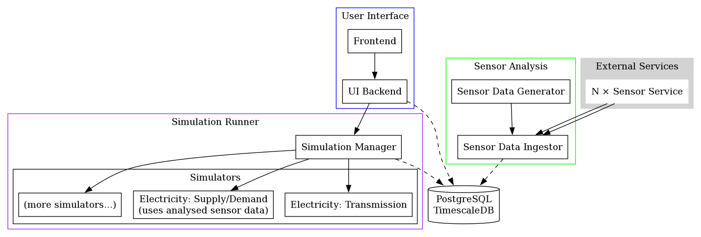

# Overview
The system consist of several components as known in the graphic below.

More info about each of these components can be found here:
- [**Simulation Manager**](./simulation/simulation-manager.md)
- [**Simulators**](./simulation/simulators.md)

## Continuous integration/deployment
Info about continuous integration and deployment can be found [**here**](ci-cd.md).
